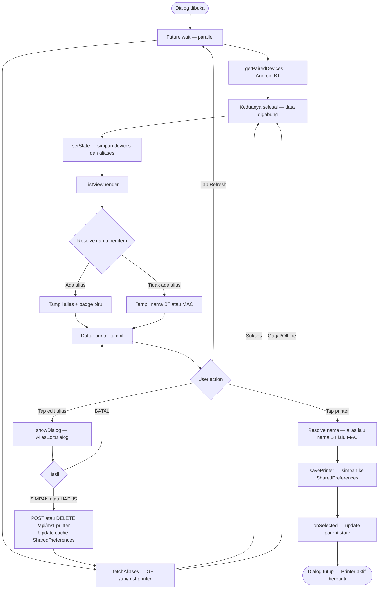

# Alur Pilih Printer Bluetooth

## Deskripsi

Alur ketika user membuka dialog pemilihan printer Bluetooth pada `PdfViewerScreen`.
Dialog menampilkan daftar perangkat BT yang sudah di-pair di Android, dilengkapi
alias dari database (`MstPrinter`) agar nama printer mudah dikenali antar tablet.

## Flowchart

## Catatan

- **Parallel fetch** — `getPairedDevices` dan `fetchAliases` berjalan bersamaan via `Future.wait`,
  total waktu tunggu = proses yang paling lambat.
- **Offline fallback** — jika API gagal, alias diambil dari cache `SharedPreferences`.
- **Alias global** — alias disimpan di tabel `MstPrinter` (SQL Server), sehingga perubahan
  nama di satu tablet otomatis terlihat di semua tablet lain saat dialog dibuka/di-refresh.
- **`AliasEditDialog`** menggunakan `StatefulWidget` agar `TextEditingController` di-dispose
  oleh Flutter setelah animasi dialog selesai, menghindari error `_dependents.isEmpty`.

## File Terkait

| File                                            | Keterangan                        |
| ----------------------------------------------- | --------------------------------- |
| `lib/common/widgets/pdf_viewer_screen.dart`     | UI dialog + logika pilih printer  |
| `lib/core/utils/master_printer_repository.dart` | Repository API MstPrinter + cache |
| `lib/core/utils/bt_print_service.dart`          | BT scan, connect, print ESC/POS   |
| `lib/core/network/endpoints.dart`               | Konstanta URL `/api/mst-printer`  |
